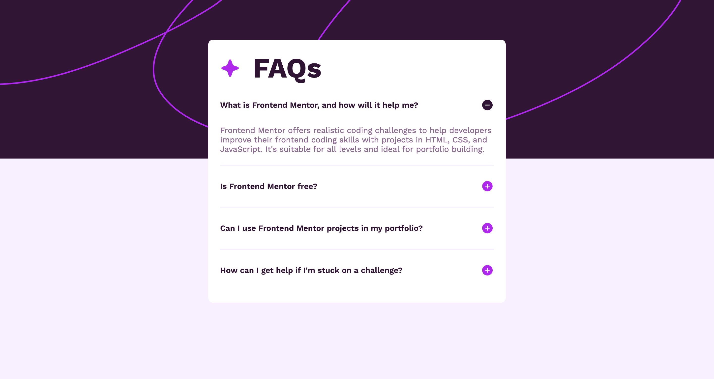

# Frontend Mentor - FAQ accordion solution

This is a solution to the [FAQ accordion challenge on Frontend Mentor](https://www.frontendmentor.io/challenges/faq-accordion-wyfFdeBwBz). Frontend Mentor challenges help you improve your coding skills by building realistic projects.

## Table of contents

- [Overview](#overview)
  - [The challenge](#the-challenge)
  - [Screenshot](#screenshot)
  - [Links](#links)
- [My process](#my-process)
  - [Built with](#built-with)
  - [What I learned](#what-i-learned)
  - [Useful resources](#useful-resources)
- [Author](#author)

## Overview

### The challenge

Users should be able to:

- Hide/Show the answer to a question when the question is clicked
- Navigate the questions and hide/show answers using keyboard navigation alone
- View the optimal layout for the interface depending on their device's screen size
- See hover and focus states for all interactive elements on the page

### Screenshot

### Links

- Solution URL: [Solution URL here](https://github.com/priyavrat8065/faq-accordian-frontmentor)
- Live Site URL: [Live site URL here](https://priyavrat8065.github.io/faq-accordian-frontmentor/)

## My process

### Built with

- Semantic HTML5 markup
- CSS custom properties
- Flexbox
- Javascript (Basic)

### What I learned

- i learnt how to use background-image and background-color together to create nice background.
- i also learnt how to use background-repeat and background-size property.

### Useful resources

- [This resource](https://www.freecodecamp.org/news/use-svg-images-in-css-html/) helped me how to use load svg file directly into css.

## Author

- Github - [My Github dashboard](https://github.com/dashboard)
- Frontend Mentor - [@priyavrat8065](https://www.frontendmentor.io/profile/priyavrat8065)
